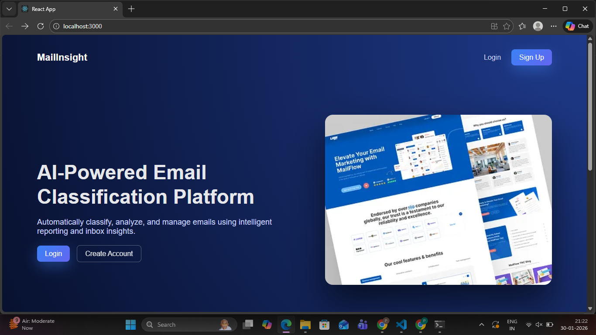
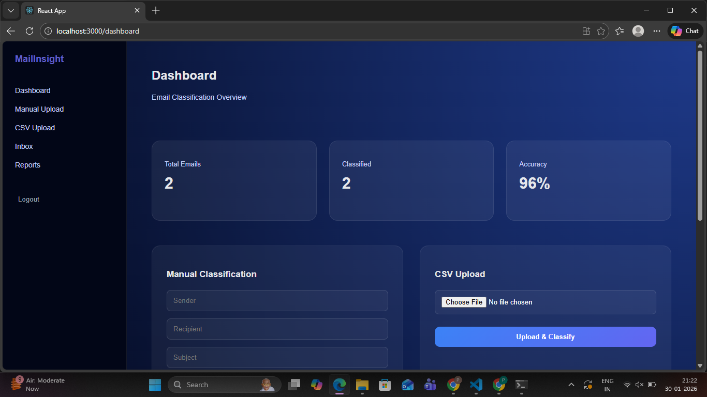
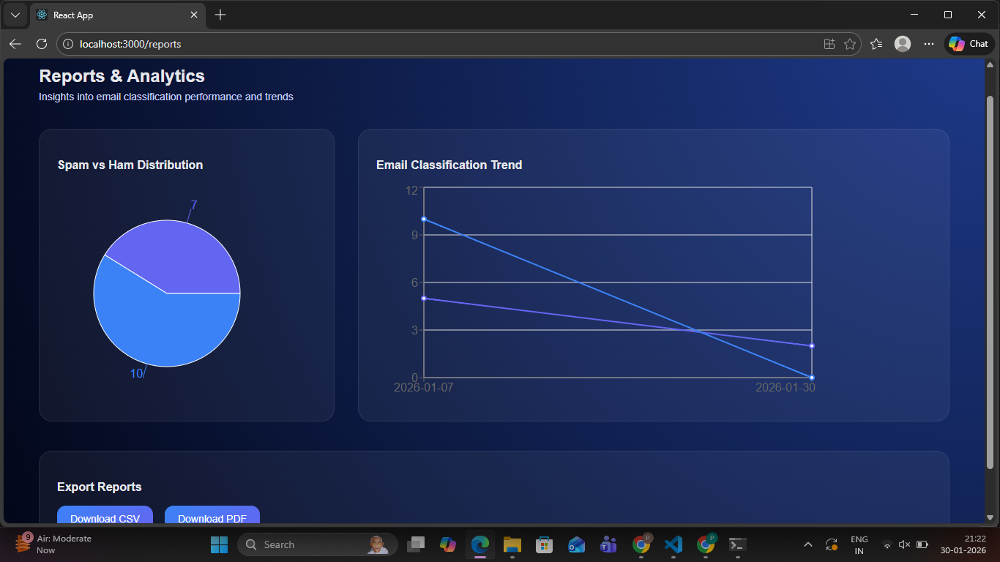

## AI-Powered Email Classification Dashboard - MailInsight

This project is a full-stack web application that classifies emails as Spam or Ham using a trained Machine Learning model (.pkl).
Users can upload emails individually or in bulk (CSV), view classification results, analyze trends, and export reports in CSV and PDF formats.

The system is built with Django REST Framework, React, and PostgreSQL, and is designed for deployment on Render, Neon, and Vercel.

## Features
### Authentication & Users

JWT-based authentication (login, register, refresh tokens)

Role-based access control (Admin / User)

Change password functionality

User profile endpoint (/me)

### Email Classification

Classify emails as Spam / Ham using ML model

Automatic text preprocessing before prediction

Confidence score & model version tracking

Manual reclassification (user feedback)

### Bulk Upload

Upload CSV files containing emails

Auto-detect sender, recipient, subject, and body columns

Batch classification with transaction safety

### Analytics & Reports

Spam vs Ham distribution

Spam trends over time

Export classified data as:

 CSV

PDF summary report

### Admin & API

Secure REST APIs using Django REST Framework

Django Admin panel for data management

CORS-enabled for frontend integration

## Tech Stack
Frontend

React.js

Axios (API communication)

HTML5, CSS3, JavaScript

Responsive UI (desktop, tablet, mobile)

Backend

Django 5.x

Django REST Framework

JWT Authentication (SimpleJWT)

PostgreSQL (Neon – production)

SQLite / PostgreSQL (local development)

Machine Learning

Scikit-learn

Trained .pkl model

Text preprocessing pipeline


## Project Structure
```
project-root/
├── frontend/                # React frontend
│   ├── src/
│   │   ├── api.js            # Axios instance with JWT refresh
│   │   ├── components/
│   │   ├── pages/
│   │   └── styles/
│   └── .env.example
│
├── backend/                 # Django backend
│   ├── email_classifier/
│   │   ├── settings.py
│   │   ├── urls.py
│   │   └── wsgi.py
│   │
│   ├── accounts/            # Auth & users
│   ├── emails/              # Email classification logic
│   ├── reports/             # CSV & PDF exports
│   ├── ml/                  # ML model & preprocessing
│   │   ├── model.pkl
│   │   ├── ml_loader.py
│   │   └── preprocess.py
│   │
│   ├── manage.py
│   ├── requirements.txt
│   └── .env.example
│
├── assets/
│   └── screenshots/
│       ├── dashboard.png
│       ├── upload.png
│       ├── reports.png
│       └── admin.png
│
└── README.md
```
## Screenshots
### Dashboard


### Inbox

### Reports


## Backend Setup (Django)
1️⃣ Clone the repository
```bash
git clone https://github.com/your-username/email-classifier.git
cd email-classifier/backend
```
2️⃣ Create virtual environment
```bash
python -m venv venv
source venv/bin/activate  # Windows: venv\Scripts\activate
```
3️⃣ Install dependencies
```bash
pip install -r requirements.txt
```
4️⃣ Environment variables (.env)
SECRET_KEY=your-secret-key
DEBUG=True

DB_NAME=email_db
DB_USER=postgres
DB_PASSWORD=yourpassword
DB_HOST=localhost
DB_PORT=5432

ALLOWED_HOSTS=localhost,127.0.0.1

5️⃣ Run migrations & server
```bash
python manage.py migrate
python manage.py createsuperuser
python manage.py runserver
```
## Frontend Setup (React)
```bash
cd frontend
npm install
npm start
```
.env (frontend)
REACT_APP_API_BASE_URL=http://localhost:8000/api


## Security Notes

No secrets are hard-coded

Environment variables used everywhere

JWT tokens stored client-side

CORS & CSRF properly configured for production

## License

This project is licensed under the MIT .

## Contact

If you have questions or want to collaborate:

GitHub: PoornimaChowdary560

Email: poornimamaddipati22@gmail.com.com